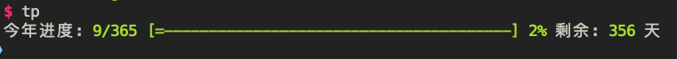

# Time Spent

  

> Display past time on the terminal.



## Install

```sh
npm install time-spent -g
```

## Usage

```sh
tp     # show current year
```

```sh
tp m   # show current month
```

```sh
tp w   # show current week
```

## Develop

```sh
npm install
```

## Contributing

1. Fork it (<https://github.com/xrr2016/time-spent/fork>)
2. Create your feature branch (`git checkout -b feature/fooBar`)
3. Commit your changes (`git commit -am 'Add some fooBar'`)
4. Push to the branch (`git push origin feature/fooBar`)
5. Create a new Pull Request

## License

[MIT](LICENSE)
